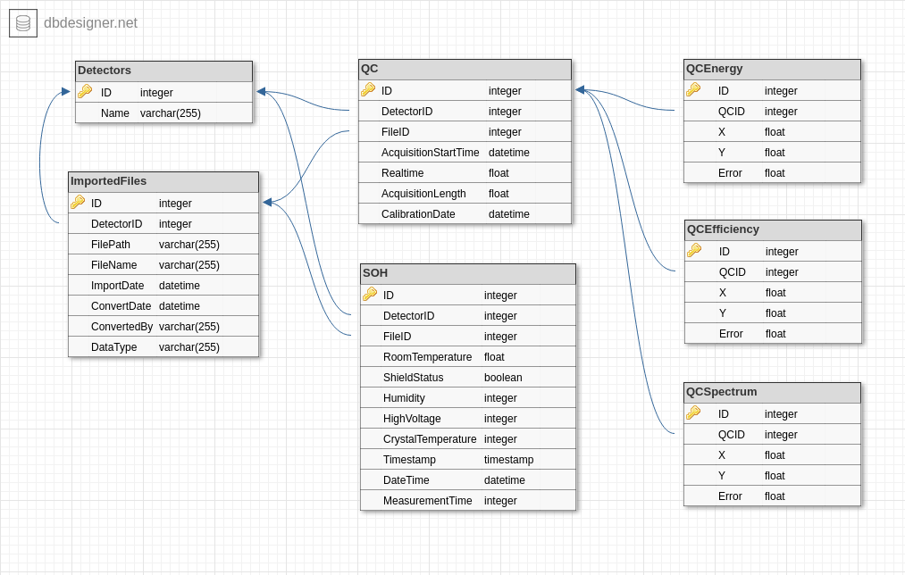

# IMS2SQL

## Description
This script imports IMS2.0 files directly to a MySQL server. Written for PHENIX experiment.

## Prerequisities
* C++17 compatible compiler
* MySQL/MariaDB server
* MySQL/MariaDB C Connector (libmysqlclient and libmysqlclient-dev for compiling)
* CMake

## Parameters
Simply running the code doesn't do anything. You need to specify at least one file or a directory which contains IMS2.0 files (do not need to separate SOH and QC files). The database structure and the script will make sure to prevent any duplication. The current syntax is for MySQL/MariaDB. Every added file checked if it is a valid IMS2.0 file.
- `-f soh_USP` Specify a file. Can be used multiple times to specify more than one file.
- `-R` Enable recursive directory scan. Must specified before adding any directory.
- `-d ims_files_dir/` Specify a directory which contains the IMS files. Every file from that directory will be opened and converted. Also can be used multiple times for adding more than one directory.
- `-n database_name` Specify the database name. By default it will use Decay. The importable structure file also use this.
- `-N` The database contains the user's name, who converted and uploaded the data. You can use this parameter to specify it for one time, or edit the source code and rebuild the application.
- `-v number` Set valid flag explicitly. If the number is 0, then the flag will be false, if anything else, it will be true. 
- `-h` Print help 

## Log files
Log files are saved in a directory called IMS2SQL near the binary file. If it can't be used, it will increment a counter until find a usable one, for example IMS2SQL0. One log file generated per day without overwriting the existing one. There are four type of log messages: INFO, WARNING, ERROR, DEVELOPER. You can turn off logging completely or by setting the corresponding bit to true or false. Look at the constructor of class LOG. By default every type of message are enabled for testing purposes. One line definition in the log file: `[MESSAGE TYPE][SENDER][DATE TIME]: MESSAGE`

## Build
Before compilation, edit [source/SQLGenerator.cpp](source/SQLGenerator.cpp) and set the correct username and password for the MySQL server.
 - `git clone https://github.com/divaldo95/IMS2SQL.git`
 - `cd IMS2SQL && mkdir build && cd build`
 - `cmake ../`
 - `make -jN` Where N is the number of jobs to run simultaneously

 ## Database
 There is an [SQL script](database/decay_mysql_create.sql), which creates the database and the tables in the database folder. Just import it.
 The [structure](database/structure.png) can be found in that directory: . As of the latest update, I switched to MySQL Workbench, which means that the database structure can be viewed by opening [structure.mwb](database/structure.mwb). Use MySQL Workbench for forward engineering the model into an SQL script. If you are using older versions of MySQL/MariaDB and run into a syntax error because of the VISIBLE word, just remove all of it from the SQL script and import it again.

# Changelog
## 2020-10-06
* Modifications on memory handling
* Added certificate readings
* Added intensity readings
* Added isotope readings
* You can set explicitly valid flag on a set of files or directories
* QC files with only zero values are set to Valid = false on upload
* Added version control tables to the database
* Uploaded database model in MySQL Workbench format
* Updated the structure script and image

## 2020-07-20
* Initial version